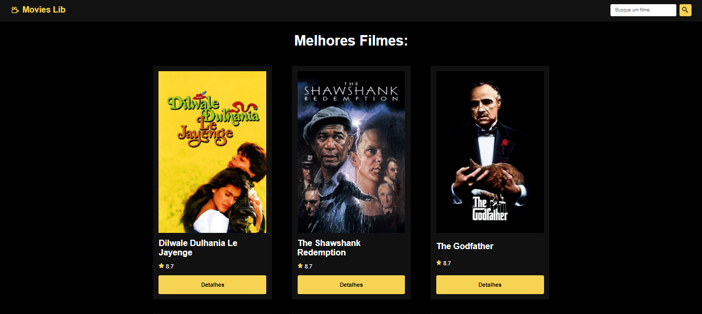

# MOVIES LIB

  

## Objetivo:

### Foi criar um site que extraia dados dos filmes de uma api externa, listando e criando um site funcional.

## Descrição:

- `Projeto feito com React JS`
- `Foi utilizado react router dom para configurar as rotas`
- `Todos os dados são extraido da API do TMBD`
- `Cada filme há um botão para ver as informações dos filmes`
- `Há um campo de busca que permite o usuário buscar os filmes pelo título`

## <i>Douglas Monteiro</i> 😁🔥🚀
